<div align="center">


</div>

<br>


<br>


<br>

### Directions

Where the work points, independent of what happens to be open in my editor.

```
performance   ::  memory hierarchies, kernels, the distance between correct and fast
representation::  graphs, lattices, encodings — choosing the shape a problem is solved in
systems       ::  specifications as data, hardware as a thing worth reading closely
matter        ::  defects, dopants, and what physics permits before anyone optimizes it
```

<br>



<br>

### Now

<sup>rolling — last updated 2026-02</sup>

**`matmul-optimization`** · CUDA, C++ — custom SGEMM kernels toward cuBLAS-class throughput.<br>
**`riscv-db`** · PostgreSQL, Python — the official RISC-V ISA spec, normalized into queryable relations.<br>
**`gnn-dopant-viability`** · PyTorch — graph networks for p-type dopant viability in β-Ga₂O₃.<br>
**`radian`** · computer vision — persistent identities for trees and farmland from drone imagery.

Pinned repositories carry the detail.

<br>

### Stack


<br>

### Education



<br>

### Internet Coordinates

<p>
<a href="https://twitter.com/gitblamesatnam"></a>
<a href="https://www.linkedin.com/in/satnamcodes"></a>
<a href="https://www.instagram.com/dontblamesatnam"></a>
<a href="https://github.com/SatnamCodes"></a>
</p>

<sub>**spaceflora** — astrophotography outreach, featured by NASA</sub>

<br>


