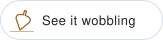
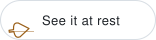
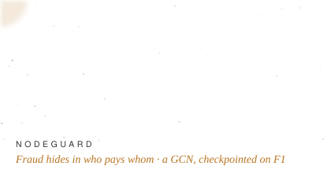

<a name="totem"><picture><source media="(prefers-color-scheme: dark)" srcset="assets/totem-dark.svg"><source media="(prefers-color-scheme: light)" srcset="assets/totem-light.svg"></picture></a> Click the top for its blueprint and its other states

 
<picture>
  <source media="(prefers-color-scheme: dark)" srcset="assets/blueprint-dark.svg">
  <source media="(prefers-color-scheme: light)" srcset="assets/blueprint-light.svg">
  
</picture>
  
Today's state is above. The other two, from example fortnights:
  

<!-- states -->

<a name="wobbling"><picture><source media="(prefers-color-scheme: dark)" srcset="assets/states/wobbling-button-dark.svg"><source media="(prefers-color-scheme: light)" srcset="assets/states/wobbling-button-light.svg"></picture></a>

 
<a name="wobbling-top"><picture><source media="(prefers-color-scheme: dark)" srcset="assets/states/wobbling-top-dark.svg"><source media="(prefers-color-scheme: light)" srcset="assets/states/wobbling-top-light.svg"></picture></a>
 
<picture><source media="(prefers-color-scheme: dark)" srcset="assets/states/wobbling-blueprint-dark.svg"><source media="(prefers-color-scheme: light)" srcset="assets/states/wobbling-blueprint-light.svg"></picture>

<a name="at-rest"><picture><source media="(prefers-color-scheme: dark)" srcset="assets/states/at-rest-button-dark.svg"><source media="(prefers-color-scheme: light)" srcset="assets/states/at-rest-button-light.svg"></picture></a>

 
<a name="at-rest-top"><picture><source media="(prefers-color-scheme: dark)" srcset="assets/states/at-rest-top-dark.svg"><source media="(prefers-color-scheme: light)" srcset="assets/states/at-rest-top-light.svg"></picture></a>
 
<picture><source media="(prefers-color-scheme: dark)" srcset="assets/states/at-rest-blueprint-dark.svg"><source media="(prefers-color-scheme: light)" srcset="assets/states/at-rest-blueprint-light.svg"></picture>

<!-- /states -->

<!-- totem -->
<b>Spinning true</b> · 16 contributions in the last 14 days · measured 10 Oct 2026
<!-- /totem -->

<picture><source media="(prefers-color-scheme: dark)" srcset="assets/title-dark.svg"><source media="(prefers-color-scheme: light)" srcset="assets/title-light.svg"></picture>

I work where the equations meet the hardware. On one side, models of physical things: crystals, fluids, planets. On the other, the GPU code those models run on, measured until every number has an explanation.

- **AI infrastructure.** *Making the machine explain itself.* A CUDA SGEMM taken from a naive kernel through coalescing and shared-memory tiling, 169.6 → 1,052.9 GFLOPS on an RTX 4060 (6.5×), profiled in Nsight Systems and Nsight Compute; register blocking, warp tiling and Tensor Cores next. Warp divergence in the neighbour-gather step of a particle simulation, over a million particles.
- **AI research.** *Teaching a network the shape of a defect.* Graph neural networks over a defect's real crystal structure, predicting formation energies and ionization levels of p-type dopants in β-Ga₂O₃; abstract under review at IIM ATM 2026. An independent study asking whether exoplanet habitability indices reduce to a few physical quantities.
- **ML engineering.** *Models that survive contact with real data.* NodeGuard, a GCN in PyTorch Geometric that finds fraud rings under heavy class imbalance; recall-only checkpointing settled on a degenerate model, so it checkpoints on F1. A multi-agent retrieval system (LangGraph, FAISS) that checks every generated claim against its sources with sentence-level NLI.
- **Software engineering.** *A specification made queryable.* A pipeline that loads 1,700+ RISC-V YAML specification files into PostgreSQL: 8 tables, 1,351 instructions, 396 control and status registers. Python, C++, FastAPI, Docker, Linux.

**Education.** Indian Institute of Technology Madras, B.S. in Data Science and Applications (2025–2029). Delhi Public School, Bathinda.

 

<a href="https://github.com/SatnamCodes/matmul"><picture><source media="(prefers-color-scheme: dark)" srcset="assets/shots/sgemm-dark.svg"><source media="(prefers-color-scheme: light)" srcset="assets/shots/sgemm-light.svg"></picture></a>
<a href="https://satnamwanders.dev/research/p-type-dopants-in-beta-ga2o3"><picture><source media="(prefers-color-scheme: dark)" srcset="assets/shots/dopants-dark.svg"><source media="(prefers-color-scheme: light)" srcset="assets/shots/dopants-light.svg"></picture></a>

<a href="https://github.com/SatnamCodes/gpu-neighbor-gather-divergence"><picture><source media="(prefers-color-scheme: dark)" srcset="assets/shots/warp-dark.svg"><source media="(prefers-color-scheme: light)" srcset="assets/shots/warp-light.svg"></picture></a>
<a href="https://satnamwanders.dev/projects/nodeguard"><picture><source media="(prefers-color-scheme: dark)" srcset="assets/shots/nodeguard-dark.svg"><source media="(prefers-color-scheme: light)" srcset="assets/shots/nodeguard-light.svg"></picture></a>

<a href="https://satnamwanders.dev/projects/risc-v-knowledge-db"><picture><source media="(prefers-color-scheme: dark)" srcset="assets/shots/riscv-dark.svg"><source media="(prefers-color-scheme: light)" srcset="assets/shots/riscv-light.svg"></picture></a>
<a href="https://satnamwanders.dev"><picture><source media="(prefers-color-scheme: dark)" srcset="assets/shots/exoplanets-dark.svg"><source media="(prefers-color-scheme: light)" srcset="assets/shots/exoplanets-light.svg"></picture></a>

  

<picture><source media="(prefers-color-scheme: dark)" srcset="assets/city-dark.svg"><source media="(prefers-color-scheme: light)" srcset="assets/city-light.svg"></picture>

See the year flat

 
<picture><source media="(prefers-color-scheme: dark)" srcset="assets/heatmap-dark.svg"><source media="(prefers-color-scheme: light)" srcset="assets/heatmap-light.svg"></picture>

  

<picture><source media="(prefers-color-scheme: dark)" srcset="assets/kit-dark.svg"><source media="(prefers-color-scheme: light)" srcset="assets/kit-light.svg"></picture>

  

<a href="https://satnamwanders.dev"><picture><source media="(prefers-color-scheme: dark)" srcset="assets/links/site-dark.svg"><source media="(prefers-color-scheme: light)" srcset="assets/links/site-light.svg"></picture></a>
<a href="https://www.linkedin.com/in/satnamcodes"><picture><source media="(prefers-color-scheme: dark)" srcset="assets/links/linkedin-dark.svg"><source media="(prefers-color-scheme: light)" srcset="assets/links/linkedin-light.svg"></picture></a>
<a href="https://twitter.com/gitblamesatnam"><picture><source media="(prefers-color-scheme: dark)" srcset="assets/links/x-dark.svg"><source media="(prefers-color-scheme: light)" srcset="assets/links/x-light.svg"></picture></a>
<a href="https://www.instagram.com/dontblamesatnam"><picture><source media="(prefers-color-scheme: dark)" srcset="assets/links/instagram-dark.svg"><source media="(prefers-color-scheme: light)" srcset="assets/links/instagram-light.svg"></picture></a>

  

<b>spaceflora</b>: astrophotography outreach, featured by NASA

