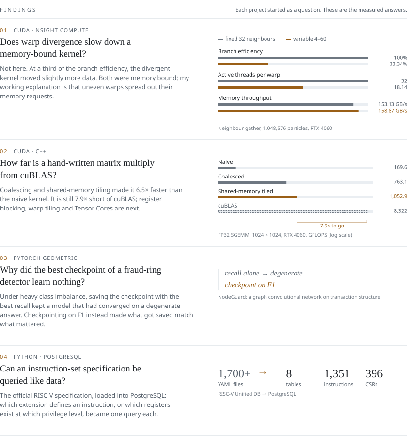

<!-- totem -->
<b>Spinning true</b> · 46 contributions in the last 14 days · measured 9 Oct 2026 Nobody has spun it yet.
<!-- /totem -->

<b><a href="https://github.com/SatnamCodes/SatnamCodes/issues/new?title=spin&body=Submit%20this%20issue%20to%20spin%20the%20top.%0A%0AA%20GitHub%20Action%20spins%20it%2C%20signs%20your%20name%20under%20it%20on%20the%20profile%2C%20and%20closes%20this%20issue%2C%20usually%20within%20a%20minute.">↻ Spin the top</a></b> 
Opens an issue titled “spin”. Submit it and a GitHub Action spins the top, signs your name under it and closes the issue, usually within a minute. Left alone, it runs on my contribution calendar: true when I've been building steadily, wobbling when I haven't, at rest when I stop.

 

### Satnam Singh

Machine learning for physical and materials systems, GPU performance in scientific computing, and exoplanet habitability. B.Tech in Computer Science (AI and ML) at Christ University, Bengaluru, alongside a B.S. in Data Science at IIT Madras.

 

<picture>
  <source media="(prefers-color-scheme: dark)" srcset="assets/findings-dark.svg">
  <source media="(prefers-color-scheme: light)" srcset="assets/findings-light.svg">
  
</picture>

 

**Now**

- **Graph neural networks for p-type dopant viability in β-Ga₂O₃**, Centre of Excellence for Frontier Materials Research, Christ University. [Abstract](https://satnamwanders.dev/research/p-type-dopants-in-beta-ga2o3) under review at IIM ATM 2026.
- **The fundamental quantities behind exoplanet habitability indices**, an independent study supervised by Dr. Shilpashree S P. In the data analysis stage.
- **[Custom CUDA SGEMM](https://github.com/SatnamCodes/matmul)**: register blocking, warp tiling and Tensor Cores next.
- **Retrieval for scientific literature**: a multi-agent pipeline that checks each generated claim against its sources with sentence-level natural language inference.

[satnamwanders.dev](https://satnamwanders.dev) · [LinkedIn](https://www.linkedin.com/in/satnamcodes) · [X](https://twitter.com/gitblamesatnam) · [Instagram](https://www.instagram.com/dontblamesatnam)

Tools and languages

 

**Programming** Python, C++, C, CUDA, SQL 
**Tools** Nsight Systems, Nsight Compute, Git, Linux, Docker, PostgreSQL, FastAPI 
**ML** PyTorch, PyTorch Geometric, scikit-learn, XGBoost, LangGraph, FAISS 
**Speaks** Punjabi, Hindi, English

**spaceflora**: astrophotography outreach, featured by NASA

