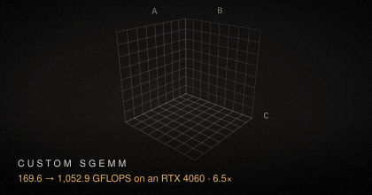
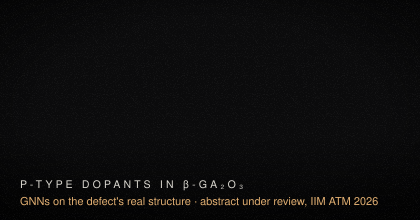
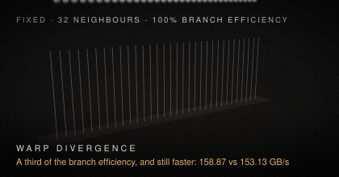
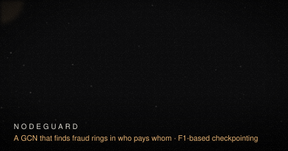
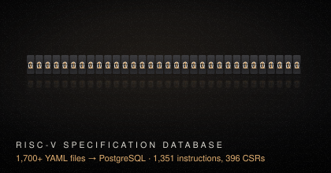
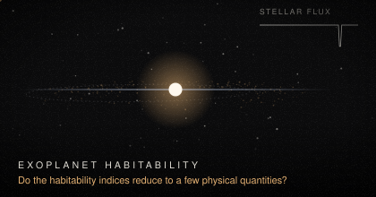
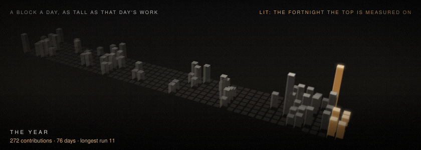
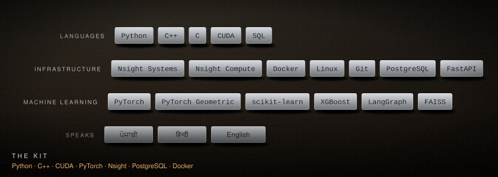

 Click the top for its blueprint and its other states

 
<picture>
  <source media="(prefers-color-scheme: dark)" srcset="assets/blueprint-dark.svg">
  <source media="(prefers-color-scheme: light)" srcset="assets/blueprint-light.svg">
  
</picture>
  
Today's state is above. The other two, from example fortnights:
  

<!-- states -->

<a name="wobbling"><picture><source media="(prefers-color-scheme: dark)" srcset="assets/states/wobbling-button-dark.svg"><source media="(prefers-color-scheme: light)" srcset="assets/states/wobbling-button-light.svg"></picture></a>

 

 
<picture><source media="(prefers-color-scheme: dark)" srcset="assets/states/wobbling-blueprint-dark.svg"><source media="(prefers-color-scheme: light)" srcset="assets/states/wobbling-blueprint-light.svg"></picture>

<a name="at-rest"><picture><source media="(prefers-color-scheme: dark)" srcset="assets/states/at-rest-button-dark.svg"><source media="(prefers-color-scheme: light)" srcset="assets/states/at-rest-button-light.svg"></picture></a>

 

 
<picture><source media="(prefers-color-scheme: dark)" srcset="assets/states/at-rest-blueprint-dark.svg"><source media="(prefers-color-scheme: light)" srcset="assets/states/at-rest-blueprint-light.svg"></picture>

<!-- /states -->

<!-- totem -->
<b>Spinning true</b> · 46 contributions in the last 14 days · measured 9 Oct 2026
<!-- /totem -->

## Satnam Singh

**Machine learning engineering · AI infrastructure · AI research · Software engineering**

I build machine learning models of physical systems and the GPU code they run on, and I profile both until the numbers make sense.

- **AI infrastructure.** A CUDA SGEMM taken from a naive kernel through coalescing and shared-memory tiling, 169.6 → 1,052.9 GFLOPS on an RTX 4060 (6.5×), profiled in Nsight Systems and Nsight Compute; register blocking, warp tiling and Tensor Cores next. Warp divergence measured in neighbor-gather kernels over a million particles.
- **AI research.** Graph neural networks over a defect's real crystal structure, to predict formation energy and ionization levels of p-type dopants in β-Ga₂O₃ (abstract under review at IIM ATM 2026). An independent study of whether exoplanet habitability indices reduce to a few physical quantities.
- **ML engineering.** NodeGuard, a GCN in PyTorch Geometric that finds fraud rings under heavy class imbalance; recall-only checkpointing converged on a degenerate model, so it checkpoints on F1. A multi-agent retrieval system (LangGraph, FAISS) that checks each generated claim against its sources with sentence-level NLI.
- **Software engineering.** A pipeline that loads 1,700+ RISC-V YAML specification files into PostgreSQL: 8 tables, 1,351 instructions, 396 control and status registers. Python, C++, FastAPI, Docker, Linux.

**Education.** Indian Institute of Technology Madras, B.S. in Data Science and Applications (2025–2029) · Delhi Public School, Bathinda

 

  

  

  

<a href="https://satnamwanders.dev"><picture><source media="(prefers-color-scheme: dark)" srcset="assets/links/site-dark.svg"><source media="(prefers-color-scheme: light)" srcset="assets/links/site-light.svg"></picture></a>
<a href="https://www.linkedin.com/in/satnamcodes"><picture><source media="(prefers-color-scheme: dark)" srcset="assets/links/linkedin-dark.svg"><source media="(prefers-color-scheme: light)" srcset="assets/links/linkedin-light.svg"></picture></a>
<a href="https://twitter.com/gitblamesatnam"><picture><source media="(prefers-color-scheme: dark)" srcset="assets/links/x-dark.svg"><source media="(prefers-color-scheme: light)" srcset="assets/links/x-light.svg"></picture></a>
<a href="https://www.instagram.com/dontblamesatnam"><picture><source media="(prefers-color-scheme: dark)" srcset="assets/links/instagram-dark.svg"><source media="(prefers-color-scheme: light)" srcset="assets/links/instagram-light.svg"></picture></a>

  

<b>spaceflora</b>: astrophotography outreach, featured by NASA

