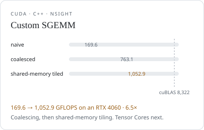
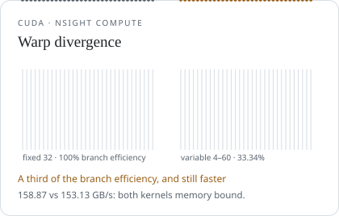
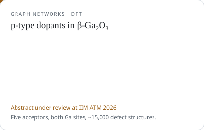
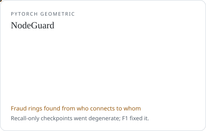
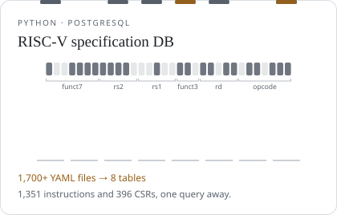

 Click the top to open its blueprint

 
<picture>
  <source media="(prefers-color-scheme: dark)" srcset="assets/blueprint-dark.svg">
  <source media="(prefers-color-scheme: light)" srcset="assets/blueprint-light.svg">
  
</picture>
  
Today's state is above. The other two, from example fortnights:
  

<!-- states -->

<a name="wobbling"><picture><source media="(prefers-color-scheme: dark)" srcset="assets/states/wobbling-button-dark.svg"><source media="(prefers-color-scheme: light)" srcset="assets/states/wobbling-button-light.svg"></picture></a>

 

 
<picture><source media="(prefers-color-scheme: dark)" srcset="assets/states/wobbling-blueprint-dark.svg"><source media="(prefers-color-scheme: light)" srcset="assets/states/wobbling-blueprint-light.svg"></picture>

<a name="at-rest"><picture><source media="(prefers-color-scheme: dark)" srcset="assets/states/at-rest-button-dark.svg"><source media="(prefers-color-scheme: light)" srcset="assets/states/at-rest-button-light.svg"></picture></a>

 

 
<picture><source media="(prefers-color-scheme: dark)" srcset="assets/states/at-rest-blueprint-dark.svg"><source media="(prefers-color-scheme: light)" srcset="assets/states/at-rest-blueprint-light.svg"></picture>

<!-- /states -->

<!-- totem -->
<b>Spinning true</b> · 46 contributions in the last 14 days · measured 9 Oct 2026
<!-- /totem -->

 

<picture>
  <source media="(prefers-color-scheme: dark)" srcset="assets/about-dark.svg">
  <source media="(prefers-color-scheme: light)" srcset="assets/about-light.svg">
  
</picture>

 

<a href="https://github.com/SatnamCodes/matmul"><picture><source media="(prefers-color-scheme: dark)" srcset="assets/cards/sgemm-dark.svg"><source media="(prefers-color-scheme: light)" srcset="assets/cards/sgemm-light.svg"></picture></a>
<a href="https://github.com/SatnamCodes/gpu-neighbor-gather-divergence"><picture><source media="(prefers-color-scheme: dark)" srcset="assets/cards/warp-dark.svg"><source media="(prefers-color-scheme: light)" srcset="assets/cards/warp-light.svg"></picture></a>

<a href="https://satnamwanders.dev/research/p-type-dopants-in-beta-ga2o3"><picture><source media="(prefers-color-scheme: dark)" srcset="assets/cards/dopants-dark.svg"><source media="(prefers-color-scheme: light)" srcset="assets/cards/dopants-light.svg"></picture></a>
<a href="https://satnamwanders.dev/projects/nodeguard"><picture><source media="(prefers-color-scheme: dark)" srcset="assets/cards/nodeguard-dark.svg"><source media="(prefers-color-scheme: light)" srcset="assets/cards/nodeguard-light.svg"></picture></a>

<a href="https://satnamwanders.dev"><picture><source media="(prefers-color-scheme: dark)" srcset="assets/cards/exoplanets-dark.svg"><source media="(prefers-color-scheme: light)" srcset="assets/cards/exoplanets-light.svg"></picture></a>
<a href="https://satnamwanders.dev/projects/risc-v-knowledge-db"><picture><source media="(prefers-color-scheme: dark)" srcset="assets/cards/riscv-dark.svg"><source media="(prefers-color-scheme: light)" srcset="assets/cards/riscv-light.svg"></picture></a>

  

<a href="https://satnamwanders.dev"><picture><source media="(prefers-color-scheme: dark)" srcset="assets/links/site-dark.svg"><source media="(prefers-color-scheme: light)" srcset="assets/links/site-light.svg"></picture></a>
<a href="https://www.linkedin.com/in/satnamcodes"><picture><source media="(prefers-color-scheme: dark)" srcset="assets/links/linkedin-dark.svg"><source media="(prefers-color-scheme: light)" srcset="assets/links/linkedin-light.svg"></picture></a>
<a href="https://twitter.com/gitblamesatnam"><picture><source media="(prefers-color-scheme: dark)" srcset="assets/links/x-dark.svg"><source media="(prefers-color-scheme: light)" srcset="assets/links/x-light.svg"></picture></a>
<a href="https://www.instagram.com/dontblamesatnam"><picture><source media="(prefers-color-scheme: dark)" srcset="assets/links/instagram-dark.svg"><source media="(prefers-color-scheme: light)" srcset="assets/links/instagram-light.svg"></picture></a>

 

<picture>
  <source media="(prefers-color-scheme: dark)" srcset="assets/heatmap-dark.svg">
  <source media="(prefers-color-scheme: light)" srcset="assets/heatmap-light.svg">
  
</picture>

  

<picture>
  <source media="(prefers-color-scheme: dark)" srcset="assets/stack-dark.svg">
  <source media="(prefers-color-scheme: light)" srcset="assets/stack-light.svg">
  
</picture>

<b>spaceflora</b>: astrophotography outreach, featured by NASA

